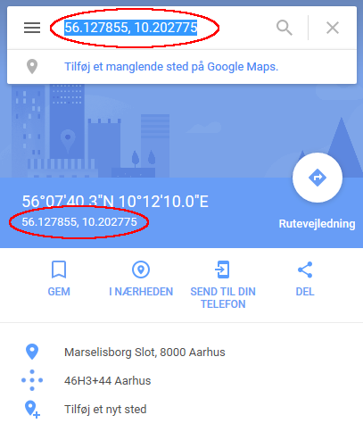
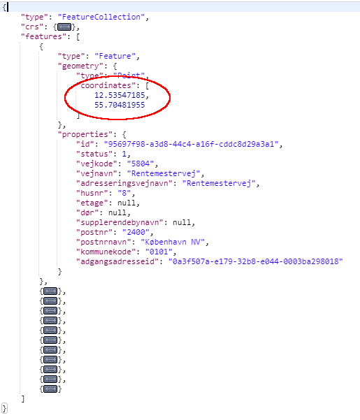

# OKAPI - Offentlig Kort API

[Dataforsyningen](https://dataforsyningen.dk) har udviklet et modul til indlejring af baggrundskort på hjemmesider. Modulet er tiltænkt webudviklere der har brug for en let implementerbar og fleksibel kortvisning på egen hjemmeside.

Modulet er implementeret i Javascript og er baseret på [OpenLayers](https://openlayers.org/).

Før brug skal man oprette en bruger på [Dataforsyningen](https://dataforsyningen.dk) og oprette en token.

<p style="text-align: center;"></p>

## Sådan gør du

1. Opret en bruger på [Dataforsyningen](https://www.dataforsyningen.dk)
2. Log ind på dataforsyningen.dk med din nye bruger, og opret en token.
3. Indsæt `<script>`-tag i `<head>`-tagget på din hjemmeside
   - Benyt enten vores CDN: `<script src="https://okapi.dataforsyningen.dk/lib/okapi-1.8.0.min.js"
  integrity="sha384-vkK/oUyzuktOgFrUWzg1wVw7cig1qUhwfiPCbJ9v4b2fBNYCbxwwJ+jrptNSX6V7"
  crossorigin="anonymous"></script>`
   - Eller hav filen liggende på din egen server: `<script src="/path/to/okapi.min.js"></script>`
4. Indsæt `<div id="map" class="geomap" data-token="...">`-tag, dér hvor du vil have kortet.
   - Husk at indsætte din egen token i `data-token`-attributten.

Nu har du et indlejret kort på din hjemmeside.

5. Indsæt `<span class="geomarker">`-tag for hvert punkt, du vil sætte i kortet.

## Indholdsfortegnelse

   * [Installation](#installation)
   * [Anvendelse](#anvendelse)
   * [Kort-parametre](#kort-parametre)
   * [Markør-parametre](#markør-parametre)
   * [Fremsøgning af koordinater](#fremsøgning-af-koordinater)

## Installation

### NPM

Først installerer du `@dataforsyningen/okapi` via NPM:
```sh
npm install @dataforsyningen/okapi --save
```

Så kan du benytte `okapi` som imports i dine Javascript-filer:
```javascript
import { Initialize } from '@dataforsyningen/okapi'

const map = new Initialize({})
```

Derefter kan du bygge/bundle dine Javascripts med Webpack/esbuild/etc. og implementere dem i de HTML-sider, du ønsker.

F.eks. i dette tilfælde, hvor vi har bygget okapi ind i filerne `bundled.js` og `bundled.css`
```html
...
<head>
  ...
  <link rel="stylesheet" href="bundled.css">
</head>
<body>

  <div
    id="map"
    class="geomap"
    data-token="InsertYourTokenHere">
  </div>

  <script src="bundled.js"></script>
</body>
...
```

### CDN

```html
<script src="https://okapi.dataforsyningen.dk/lib/okapi-1.8.0.min.js"
integrity="sha384-vkK/oUyzuktOgFrUWzg1wVw7cig1qUhwfiPCbJ9v4b2fBNYCbxwwJ+jrptNSX6V7"
crossorigin="anonymous"></script>
```

### Lokal kopi

Download filen: `https://okapi.dataforsyningen.dk/lib/okapi-1.8.0.min.js`

```html
<script src="/path/to/okapi.js"></script>
```

### CSS

Vores standard styling kan findes her: `https://okapi.dataforsyningen.dk/lib/okapi-1.8.0.min.css`

## Anvendelse

### Simpelt kort

```html
<div
  id="map"
  class="geomap"
  data-token="InsertYourTokenHere">
</div>

<script>
  var map = new okapi.Initialize({});
</script>
```

[Demo](https://okapi.dataforsyningen.dk/examples/simple.html)

### Markører

```html
<span
  class="geomarker"
  data-type="some-type"
  data-title="The marker title"
  data-description="The marker description"
  data-address="The marker address">
</span>

<div
  id="map"
  class="geomap"
  data-type=""
  data-center="auto"
  data-token="InsertYourTokenHere">
</div>

<script>
  var map = new okapi.Initialize({});
</script>
```

[Demo](https://okapi.dataforsyningen.dk/examples/markers-simple.html)

Du kan tilføje eller fjerne markører dynamisk ved at indsætte eller fjerne flere `<span>`-elementer med data og derefter køre `refresh()` funktionen fra dit okapi objekt.

```html
<script>
  var map = new okapi.Initialize({});
  // ... kode, der indsætter eller fjerner elementer ...
  map.refresh()
</script>

```

[Se demo](https://okapi.dataforsyningen.dk/examples/markers-advanced.html)

### Brug kort fra Datafordeleren

Det er muligt at hente det normale og dæmpede skærmkort fra Datafordeleren i stedet for Dataforsyningen. Det kræver at du opretter en tjenestebruger på [Datafordeleren](https://datafordeler.dk/). Denne bruger er IKKE den samme som den du bruger på Dataforsyningen.

```html
<div
  id="map"
  class="geomap"
  data-username="InsertYourUsernameHere"
  data-password="InsertYourPasswordHere">
</div>

<script>
  var map = new okapi.Initialize({});
</script>
```

[Demo](https://okapi.dataforsyningen.dk/examples/datafordeler.html)

### Flere eksempler

[Alle kort-parametre](https://okapi.dataforsyningen.dk/examples/advanced.html)

[Forskellige markører](https://okapi.dataforsyningen.dk/examples/markers-advanced.html)

[To kort på samme side](https://okapi.dataforsyningen.dk/examples/double.html)

[Andre markør-tooltips](https://okapi.dataforsyningen.dk/examples/tooltip.html)

[Tilføj et overlay fra Dataforsyningen](https://okapi.dataforsyningen.dk/examples/overlay.html)

[Custom event handling af markør klik](https://okapi.dataforsyningen.dk/examples/custom-click.html)

## Kort-parametre

Følgende parametre kan anvendes i et kort-objekt (class: `geomap`):

#### `data-type`

Angiver hvilke markør-typer, der skal vises på kortet. Hvis man fx har både banker med `data-type="bank"`, og hæveautomater med `data-type="atm"`, kan man vise den ene type med:

`data-type="bank"`

eller begge typer med:

`data-type="atm,bank"`

#### `data-zoom`

Angiv zoomniveau i heltal, for at sætte et specifikt zoom-niveau. Hvis den sættes til `"auto"`, vil kortet selv prøve at finde et passende zoom-niveau, hvor alle markører er med på kortet.
Mulige værdier: 0-13, "auto".

#### `data-center`

Hvis centeret skal automatisk sættes udfra de markører der er på kortet kan denne blive sat til auto: `data-center="auto"`. Hvis denne er sat til `"auto"` behøves `data-center-lat` og `data-center-lon` ikke at blive sat.

#### `data-center-lat` og `data-center-lon`

Angiv centerpunkt for kortet. Et koordinatpar i `WGS84`/`epsg:4326`
Eksempelvis: `data-lat="55.5"` og `data-lon="11.5"`.

Disse er ikke relevante, hvis `data-center` har værdien `auto`.

#### `data-background`

Man kan vælge imellem disse seks forskellige baggrundskort:

- `"dtk_skaermkort"`          (Almindeligt skærmkort)
- `"dtk_skaermkort_daempet"`  (Dæmpet skærmkort)
- `"forvaltning"`             (Kort til forvaltning - uden navne)
- `"orto_foraar"`             (ortofoto)
- `"kommunikation"`           (Kommunikationskort)
- `"natur_friluftskort"`      (Natur og Friluftskort)

Som standard bliver det dæmpede skærmkort brugt.

#### `data-mylocation`

Angiv om knap til Min Position skal vises.
Mulige værdier: `true` , `false`. Standard = `true`.

#### `data-zoomslider`

Angiv om Zoomslider skal vises.
Mulige værdier: `true` , `false`. Standard = `true`.

#### `data-mousewheelzoom`

Angiv om man skal kunne zoome i kortet med musehjulet.
Mulige værdier: `true` , `false`. Standard = `true`.

#### `data-layerswitcher`

Angiv om funktionen Kortvælger skal vises.
Mulige værdier: `true` , `false`. Standard = `true`.

#### `data-token`

Angiv Dataforsyningen token til autentificering.
Har du ikke allerede en token kan du oprette en på https://dataforsyningen.dk/).

#### `data-show-popup`

Angiv om der skal vises en popup med mere information når der klikkes på en markør.
Mulige værdier: `true` , `false`. Standard = `true`.

## Markør Parametre

Følgende parametre kan anvendes i et markør-object (class: `geomarker`):

#### `data-type`

Angiver hvilken markør-type det skal være. Det kunne fx være `atm` eller `bank`. Dette kan især være smart hvis man skal vise flere kort på samme side.

#### `data-title`

Angiver titlen på markøren. Kommer frem i popup-boksen.

#### `data-description`

Angiver beskrivelsen eller brødteksten på markøren. Kommer frem i popup-boksen.

#### `data-lat` og `data-lon`

Angiver koordinaterne til markøren. Et koordinatpar i `WGS84`/`epsg:4326`.

```
data-lat="55.674802"
data-lon="12.558091"
```

#### `data-address` 

Angiver adressen hvor markøren skal placeres. Denne behøves ikke at angives hvis lat og lon er angivet. Adressen vil blive slået op i adresse API https://docs.dataforsyningen.dk/#dawa. Det kan f.eks. være `data-address="Roskildevej 32, 2000 Frederiksberg"`.

## Brugerdefinerede Markører og Tooltips
Hvis man ønsker selv at vælge markør icon, kan det gøres ved at sende et object der mapper icon navn til en path til et billede.

```html
<script>
  var map = new okapi.Initialize({
    icons: {
      'museum': 'custom.png'
    }
  });
</script>
```

[Demo](https://okapi.dataforsyningen.dk/examples/markers-advanced.html)

Det er også muligt selv at lave det html element der skal vises som tooltip når der klikkes på en markør. Hvis man gør det kan man sætte flere parametre på markørene som vil blive vist i tooltippet's element med matchene class navn.

```html
<div id="popup">
  <a href="#" class="ol-popup-closer closer"></a>
  <div id="popup-content" class="ol-popup-content"></div>
  <div class="title"></div>
  <div class="description"></div>
  <div class="link"></div>
</div>

<script>
  var map = new okapi.Initialize({
    popup: document.getElementById('popup')
  });
</script>
```

[Demo](https://okapi.dataforsyningen.dk/examples/tooltip.html)

## Brugerdefineret håndtering af markør klik
Hvis du ønsker at kalde en funtion når en markør bliver klikket på kan du gøre det med funktionen `addOnFeatureClickFunction` der tager en callback funktion som parameter som den kalder med den markør der bliver klikket på som parameter.

```html
<script>
  var maps = new okapi.Initialize({});

  maps.maps[0].addOnFeatureClickFunction((feature) => {
    console.log(feature)
  })
</script>
```

[Demo](https://okapi.dataforsyningen.dk/examples/custom-click.html)

## Fremsøgning af koordinater

For at finde koordinater til en adresse kan du bruge [OpenStreetMap](https://www.openstreetmap.org) eller [Google Maps](https://maps.google.com). Du kan også bruge API'et til Danmarks AdresseRegister igennem [Danmarks Adressers Web API](https://docs.dataforsyningen.dk/#dawa), dette er nok det smarteste valg, hvis man vil lave automatiseret adressesøgning via et API.


### OpenStreetMap

På [OSM](https://openstreetmap.org) kan du søge efter din adresse, hvorefter du højreklikker og vælger `Vis adresse`.

Herefter vil koordinaterne fremgå i venstre side af skærmen. Se screendump. Det første tal er breddegrad (lat) og det næste tal er længdegrad (lon).

<p align="center"></p>


### Google

På [GoogleMaps](https://maps.google.com) kan du søge efter din adresse, hvorefter du højreklikker og vælger `Hvad er der her?`. Så vil der komme en lille boks op nederst i midten af skærmen. Tryk på tallene i boksen. (se screendump).

<p align="center"></p>

Herefter vil koordinaterne fremgå i venstre side af skærmen. Se screendump. Det første tal er breddegrad (lat) og det næste tal er længdegrad (lon).

<p align="center"></p>


### Danmarks Adresse Web API

Her er et eksempel på en adresse, som vi får et koordinat på igennem Danmarks Adresse Web API:

http://api.dataforsyningen.dk/adresser?q=rentemestervej%208,%202400&format=geojson&struktur=mini

Returnerer en samling adresser, hvor koordinaterne står i `geometry.coordinates`:

<p align="center"></p>


### Omregning til decimalgrader

Hvis man ikke har decimalgrader i `WGS84`, kan man transformere dem ved hjælp af Dataforsyningens service: webproj. ([Læs mere her](https://docs.dataforsyningen.dk/#webproj)).

Her er en eksempel-url, man kan sende af sted. Man skal dog indsætte sin egen token først:

https://api.dataforsyningen.dk/rest/webproj/v1.0/trans/EPSG%3A25832/EPSG%3A4326/550000,6220000?token=InsertYourTokenHere
